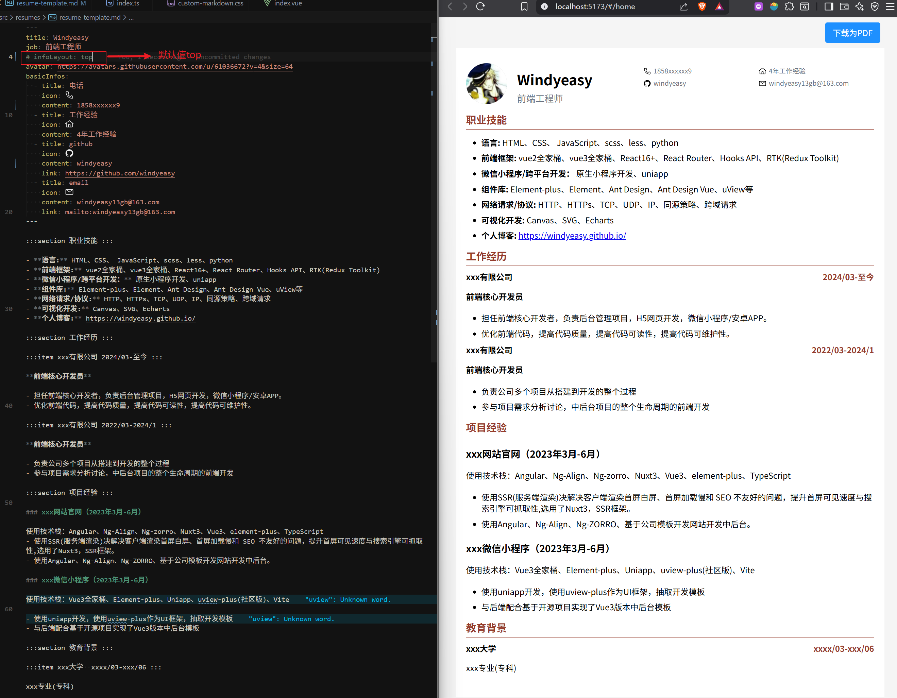
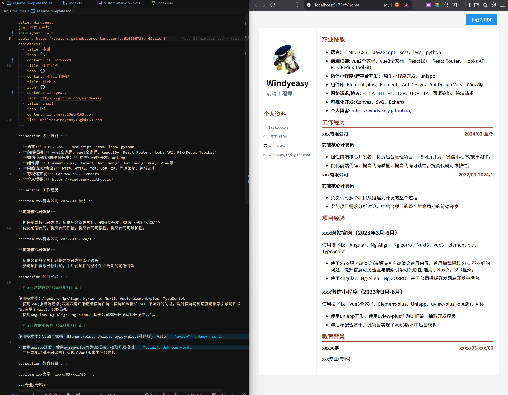
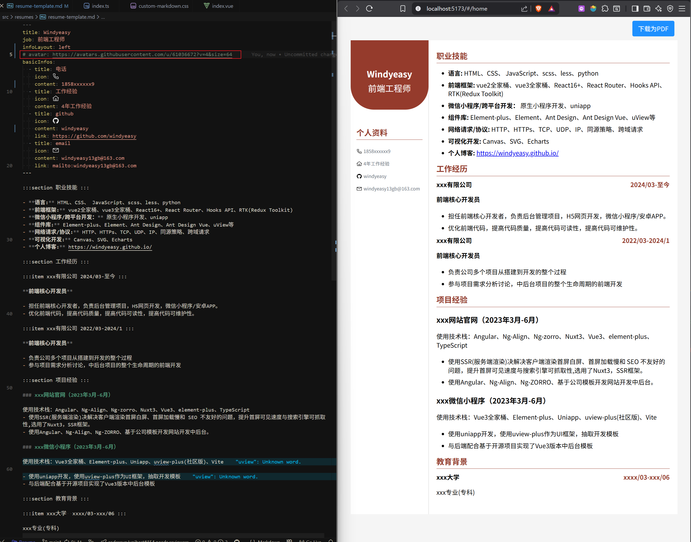
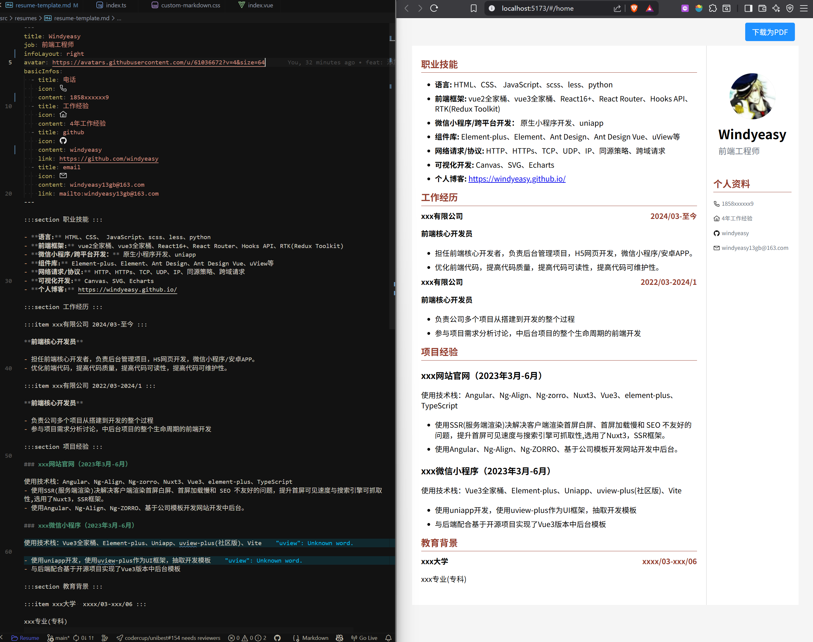
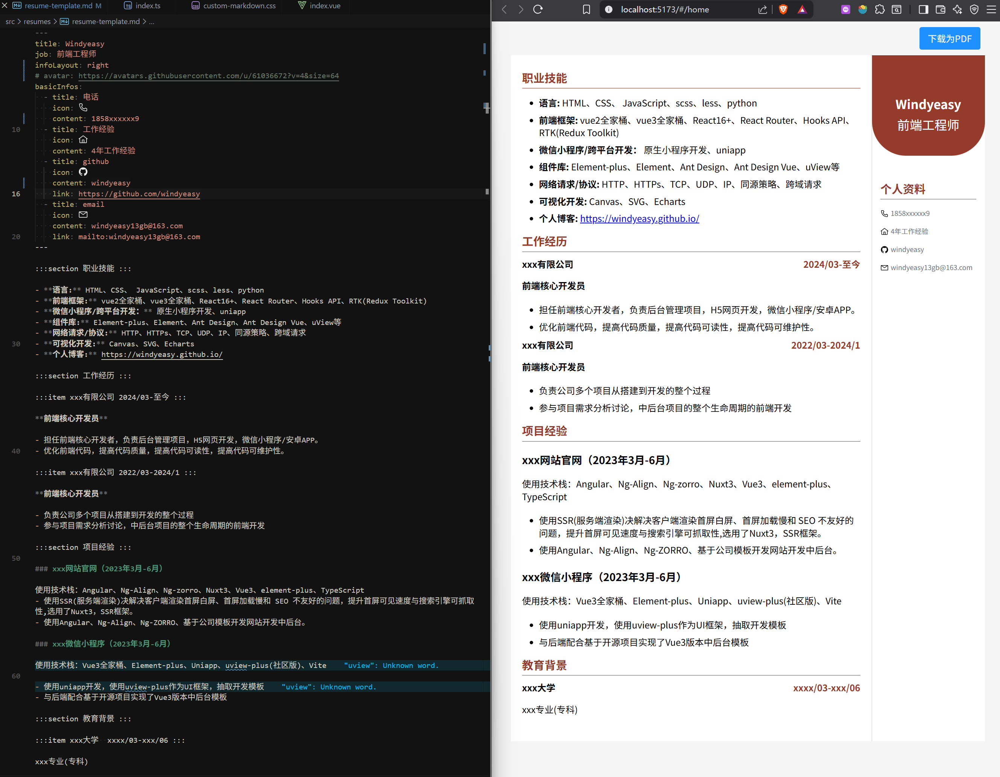
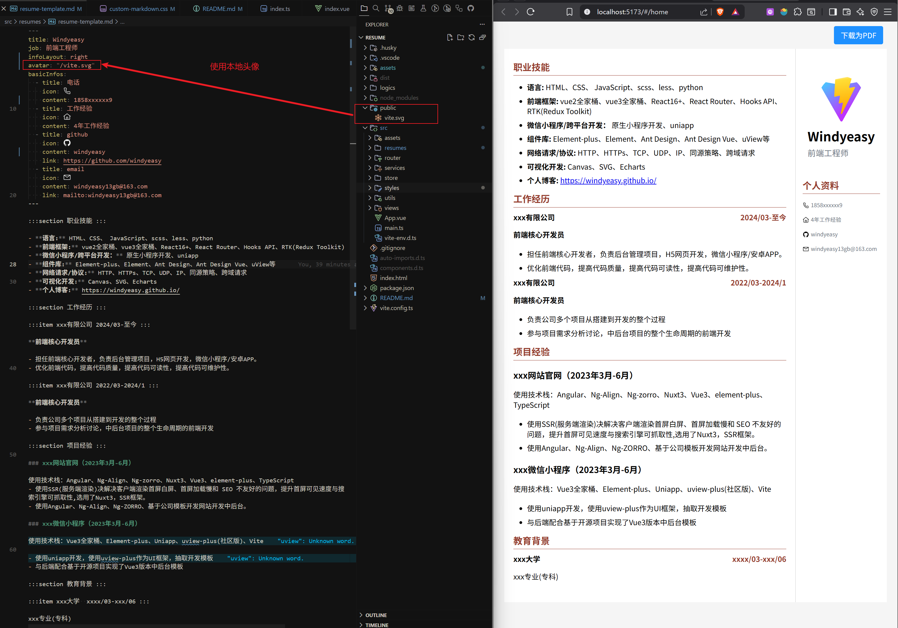
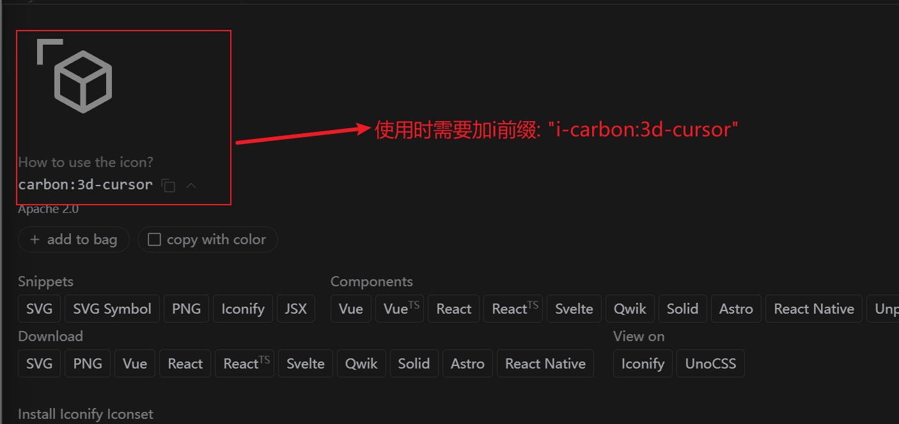
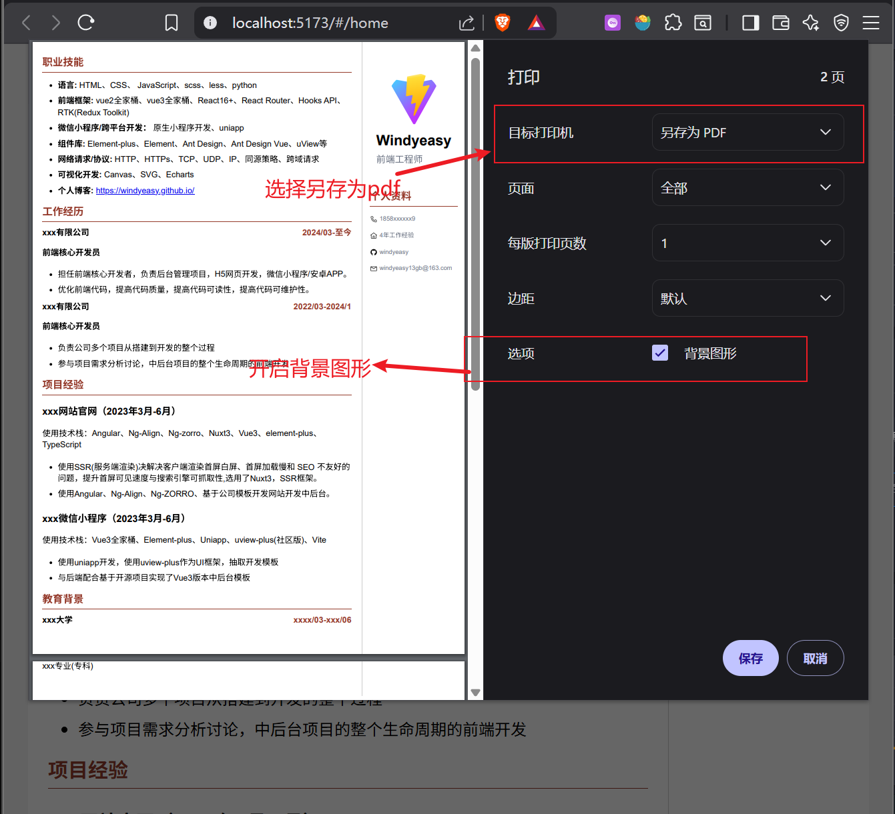

<h1 align="center">markdown-resume</h1>

一个通过markdown帮助自己写简历工具，可以打包网页或者生成PDF。

## Demo

### infoLayout

#### top 默认值

- 有头像



- 无头像


#### left

- 有头像



- 无头像



#### right

- 有头像



- 无头像



### 使用本地头像



## 图标

本项目使用了unocss集成，所以使用unocss的图标功能，默认集成了Carbon图标，[图标集合](https://icones.js.org/collection/carbon)点击查看图标集合



如果要使用其它开源图标请查看这部分文档[icons](https://unocss.net/presets/icons)

## 导出PDF注意事项



##

## 运行项目

使用node 16.0及以上的版本

### 安装依赖

```sh
pnpm install
```

### 编译重新加载开发

```sh
pnpm run dev
```

### 打包

```sh
pnpm run build
```

## 提交方法

由于使用了husky + commitlint对提交进行验证，需要使用如下几种方法提交

- 方法一：

```shell
pnpm run commit
```

- 方法二：提交时直接使用规范的格式

```shell
git commit -m "feat: 添加一个新特性"
```

## License

markdown-resume is [MIT](./LICENSE).
